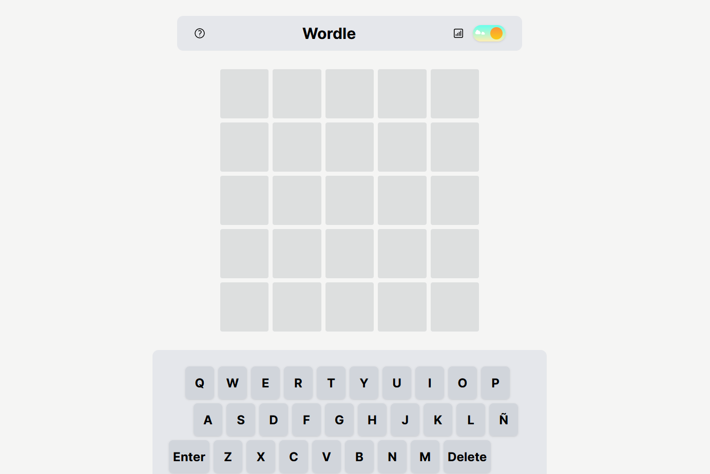

<!--  -->



<!-- TECNOLOGIAS USADAS -->
<p align=center>
     <a href="https://nodejs.org/" target="_blank"></a>
     <a href="https://www.npmjs.com/" target="_blank"></a>
     <a href="https://www.in-situ.com.mx" target="_blank"></a>
</p>

## About the project

Wordle game.

Proyecto de prueba técnica.

Consiste en dos en una reproducción del popular juego Wordle que consiste en adivinar una palabra de 5 letras en 5 intentos.
La app consiste en el juego, la funcion de recordar cantidad de partidas jugadas y número de victorias, asi como tema oscuro y claro.

 <!-- Nombre del proyecto -->

## Roadmap <!-- Features del proyecto (Actuales y planeadas) -->

- [x] Build first website stage.
- [ ] Make It Responsive

<p align="right">(<a href="#top">Back to top</a>)</p>

## Live page

<!-- Link a la pagina -->

[Live Demo](https://minigames.flattworld.net)

## Built with

<!-- This sections should only list major frameworks or libraries used to build this project. -->
<!-- Tecnologías usadas -->

[][ReactJS] <br/>
[][NextJs] <br/>

<!-- [][Jest] <br/> -->

[][TailwindCSS] <br/>

[ReactJS]: https://reactjs.org/
[NextJs]: https://https://nextjs.org/
[Jest]: https://jestjs.io/
[TailwindCSS]: https://tailwindcss.com/
[ViteJS]: https://vitejs.dev/
[NodeJS]: https://nodejs.org/
[MongoDB]: https://www.mongodb.com/

<p align="right">(<a href="#top">Back to top</a>)</p>

## Getting Started

To get a local copy and run this project follow the next steps.

<!-- COMO USAR EL PROYECTO -->

### Prerequisites

Node y npm

### Setup

```sh
$ git clone https://github.com/Flattworld/wordle
```

```sh
cd wordle
```

### Install

```sh
npm install
```

### Usage

```sh
npm run dev
```

### Run tests

```sh
npm run test
```

<!-- ### Deployment

 Make a pull request and when approved and merged the changes will show up on website.

<p align="right">(<a href="#top">Back to top</a>)</p> -->

## Authors

<!-- AUTORES -->

**NOMBRE**

[][github]
[][linkedin]

<!-- [][twitter] -->

[github]: https://github.com/Lino09
[twitter]: https://twitter.com/username
[linkedin]: https://www.linkedin.com/in/abel-hz/

<p align="right">(<a href="#top">Back to top</a>)</p>

<!-- ## Contributing

Contributions, issues and feature request are welcome!
Feel free to check the [issues page](../../../issues/).
<p align="right">(<a href="#top">Back to top</a>)</p> -->

<!-- ## Show your support

Give a ⭐️ if you like this project!
<p align="right">(<a href="#top">Back to top</a>)</p> -->

<!-- ## Acknowledgments

- Mention to anyone whose code was used
- Inspiration
- Etc.
<p align="right">(<a href="#top">Back to top</a>)</p> -->

## License

This project is `MIT` licensed.

<p align="right">(<a href="#top">Back to top</a>)</p>
